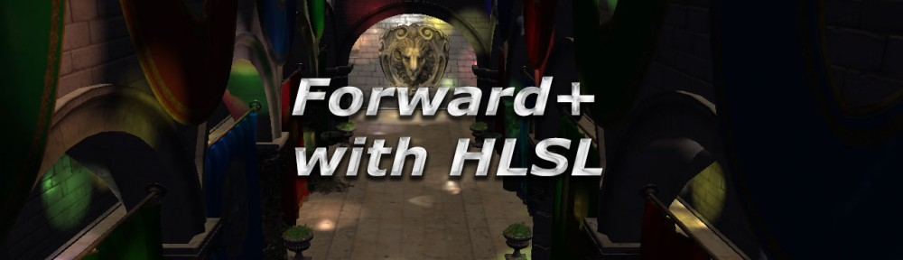

# Forward+

## Introduction

This project demonstrates the following rendering techniques.

* Forward Rendering
* Deferred Rendering
* Tiled Forward (Forward+) Rendering

To compile and run the game, see the COMPILING section below.
To install and run the game, see the INSTALLATION section below.

## Controls

The demo uses the following keyboard keys:

* `ESC`: Exits the application.
* `Q`: Pan the camera down (along the camera's local Y axis).
* `E`: Pan the camera up (along the camera's local Y axis).
* `W`: Pan the camera forward (along the camera's local Z axis).
* `A`: Pan the camera left (along the camera's local X axis).
* `S`: Pan the camera backward (along the camera's local Z axis).
* `D`: Pan the camera right (along the camera's local X axis).
* `SHIFT`: Hold shift while pressing one of the other movement keys to move the camera faster.
* `SPACE`: Animate the lights in the scene.
* `L`: Toggle rendering of light volumes.
* `F`: Moves the camera (Focus) to the currently selected light.
* `LeftArrow`: Select and focus on the previous light in the light list.
* `RightArrow`: Select and focus on the next light in the light list.
* `+`: Add one light to the light list. The currently selected light will be cloned.
* `-`: Remove the currently selected light from the light list. The last light cannot be removed. There must be at least 1 light in the scene.
* `Ctrl+S`: Save the current configuration to the configuration file.
* `Ctrl+R`: Reload the settings from the configuration file.
* `0`: Move the camera to the world origin.
* `F5`: Resets the camera to the initial position.
* `1`: Set renderer to traditional forward rendering.
* `2`: Set renderer to deferred rendering.

When in deferred rendering:

* `F1`: Toggle display of diffuse G-buffer.
* `F2`: Toggle display of specular G-Buffer.
* `F3`: Toggle display of normal G-buffer.
* `F4`: Toggle display of depth G-buffer.
* `3`: Set renderer to tiled forward (Forward+) rendering.

 When in Forward+ rendering:

* `F1`: Toggle display of per-tile light counts.

## Camera

The camera system used in the demo is a pivot camera. The pivot point is represented by a 3D axis that is aligned to the global axes. If the pivot point is not visible then either it is occluded by geometry or the pivot point is located 0 units away from the camera. If the pivot point is too close to the camera then the pivot point gizmo is not rendered. The camera functions differently if the pivot is 0 units away from the camera or greater than 0 units away from the camera.

Use the mouse scroll wheel to move the camera toward or away from the pivot point.

If the pivot point is 0 units away from the camera then the pivot point gizmo is not rendered and the camera behaves as if it is placed inside the center a large virtual sphere whose radius is half the size of the smallest screen dimension. For example if the screen dimensions are 1280x720 then the virtual sphere is orientated at the center of the screen and has a radius of 360 pixels. Clicking on the screen is equivalent to grabbing a point on the inside of the sphere and dragging to rotate the camera inside the sphere. When dragging the mouse outside the radius of the sphere will cause the camera to roll about the camera's local look-at vector (local Z axis) which is equivalent to projecting the mouse position to the outside of the sphere and rotating the camera around the delta of the angle determined by the motion of the mouse.

If the pivot point is greater than 0 units away from the camera, then the camera acts as if it is placed outside of a virtual sphere whose radius is half the size of the smallest screen dimension. In this case, the camera will pivot around the center of the virtual sphere (represented by the pivot gizmo). Aligning the pivot gizmo to an object in the scene will allow you to better inspect it.

## XBox 360 Controller

The demo has controller support but the demo only supports the XBox 360 button mapping.

### Buttons

> * `LS` - Left analog stick. (Also a button).
> * `RS` - Right analog stick (Also a button).
> * `RB` - Right bumper.
> * `LB` - Left bumper.
> * `LT` - Left trigger.
> * `RT` - Right trigger.

* `A`, `LS`: Move the camera faster.
* `RS`: Rotate the camera faster.
* `RB`: Pan the camera up.
* `LB`: Pan the camera down.
* `LT`: Pan camera away from pivot point.
* `RT`: Pan camera toward pivot point.
* `Start`: Move the camera to the currently selected light.
* `Back`: Exit the application.

### Axes

* `LS`: Pan camera.
* `RS`: Rotate camera.

### D-Pad

The controls for the 8-directional point-of-view hat.

* `Left`: Select and focus on the previous light.
* `Right`: Select and focus on the next light.

## Compiling

This project comes with solution files for Visual Studio 2022. The Visual Studio 2022 solution file can be found in the `./vs_2022/` folder.

The Visual Studio 2022 version has a dependency on the DirectX 12 SDK. The DirectX 12 SDK is installed with the "Game development with C++" workload when using the Visual Studio Installer.

## Requirements

This is a Windows project built and tested on Windows 11 (64-bit).

The Windows 10/11 version is built using Visual Studio 2022 and requires the Microsoft Visual Studio 2022 C++ Runtime to be installed before running the demo. The redistributable package can be installed from the `vs_2022` folder or downloaded from <https://learn.microsoft.com/en-us/cpp/windows/latest-supported-vc-redist?view=msvc-170#visual-studio-2015-2017-2019-and-2022>

It is not necessary to install the redistributable runtime if Visual Studio 2022 is already installed on your computer.

## Installation

Besides the Visual Studio C++ runtime requirements described in the Requirements section, there are no further dependencies required to run the demo.

The demo uses a configuration file in order to run. The default configuration file will be used if no configuration file is specified when running the demo. The configuration file defines the size of the render window, which model file to load, the default position of the camera, as well as other configuration settings. Configuration files can be found in the `./GraphicsTest/Conf/` folder. Configuration files have the .3dgep extension.

The configuration files can be used to automatically run the demo by executing the `RegisterFileType_Win10_Rel_x64.bat` file to register the Windows 10/11 64-bit version of the demo as the default handler for the .3dgep file extension. The file handlers can be removed by running the corresponding `UnregisterFileType...bat` file.

After registering the file handler, the demo can be run with a particular scene by executing the appropriately named configuration file.

## Configuration

The executable accepts only a single command-line argument which is used to specify all of the configuration settings to run the demo with a particular
scene file. The easiest way to create a new configuration file is to copy an existing one and modify the existing settings.

Do not delete the `./GraphicsTest/Conf/DefaultConfiguration.3dgep` file as this one is used if no configuration file is specified on the command-line
when running the program (for example, if the executable is launched by double-clicking on the .exe file in Windows Explorer).

The configuration files are XML documents that contain the following information:

* **WindowWidth** (int)        : The width of the window's client area in pixels.
* **WindowHeight** (int)       : The height of the window's client area in pixels.
* **FullScreen** (int)         : Currently unsupported. Set to 0 for windows mode, or 1 for full screen mode.
* **SceneFileName** (string)   : The path to the model file to load. This path is expressed relative to the configuration file.
* **SceneScaleFactor** (float) : A scale factor to apply to the scene after loading.
* **CameraPosition** (float3)  : A 3-component vector representing the initial 3D position of the camera.
* **CameraRotation** (float4)  : A rotation quaternion representing the initial 3D rotation of the camera. No rotation is (0, 0, 0, 1)
* **NormalCameraSpeed** (float): The speed of the camera.
* **FastCameraSpeed** (float)  : The speed of the camera while the `Shift` key is pressed.
* **CameraPivotDistance** (float): The initial distance that the cameras rotation pivot point is placed in front of the camera.

The next set of configuration settings found in the configuration file are also configurable using the on-screen GUI "Generate Lights" panel that appears in the application.

* **Lights** (Array)           : The lights array should only be configured using the on-screen GUIs.
* **LightsMinBounds** (float3) : The minimum bounds to generate lights.
* **LightsMaxBounds** (float3) : The maximum bounds to generate lights.
* **MinSpotAngle** (float)     : The minimum spot light angle (in degrees) to use when generating spot lights.
* **MaxSpotAngle** (float)     : The maximum spot light angle (in degrees) to use when generating spot lights.
* **MinRange** (float)         : The minimum range of generated light sources.
* **MaxRange** (float)         : The maximum rnage of generated light sources.
* **GeneratePointLights** (int): Set to 1 to include point lights during light generation. Set to 0 to not include point lights during light generation.
* **GenerateSpotLights** (int) : Set to 1 to include spot lights during light generation. Set to 0 to not include spot lights during light generation.
* **GenerateDirectionalLights** (int): Set to 1 to include directional lights during light generation. Set to 0 to not include directional lights during light generation.
* **LightGenerationMethod** (int): Set to 0 for uniform distribution of lights during light generation. Set to 1 for random distribution of lights during light generation.

## Troubleshooting

This section describes troubleshooting tips if the demo does not run.

* If the demo does not run make sure you have read the Requirements and Installation sections of this document.
* If you still have problems running the demo then leave a comment on the website and I will try to answer your comment.

Website for more information: <http://www.3dgep.com/forward-plus/>

## Known Issues

## FAQ

## Maintainers

This project is maintained by

* Jeremiah van Oosten (<jeremiah@3dgep.com>)
